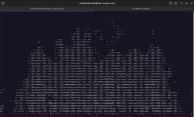
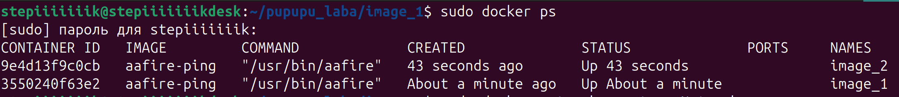
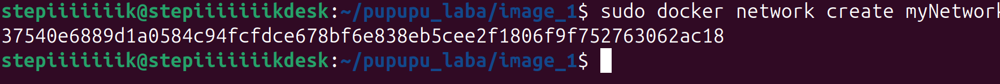
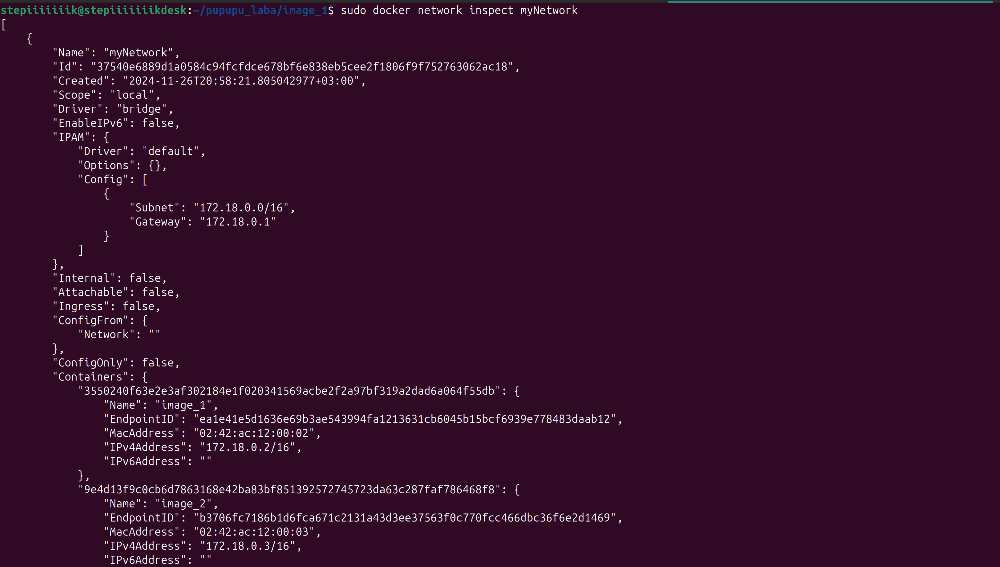

# Лабораторная работа 4.

Создаю docker image (образ). Для этого пишу Dockerfile. Создаю пустой файл, где в первую очередь указываю, что мой образ будет работать на основе Ubuntu последней достпной версии (latest).  
```
FROM ubuntu:latest
```
Далее указываю, что мы обновляем пакетный менеджер и устанавливаем библиотеку `libaa-bin` в которой содержится `aafire`. 
```
RUN apt-get update && apt-get install -y libaa-bin
```
На этом Dockerfile готов, закрываю и сохраняю его под этим названием. В терминале в папке с этим файлом запускаю команду сборки образа с тегом “aafire”.
```
docker build -t aafire .
```
Далее запускаю контейнер на основе созданного образа и подключаюсь к нему напрямую. При создании контейнера передаю ему запуск приложения “aafire”, которое находится в папке /usr/bin/aafire

`-it` флажок, который обозначает, что приложение будет работать бесконечно

```
docker run -it aafire /usr/bin/aafire
```

Результат работы программы:



Далее настраиваю сеть между двумя контейнерами: для этого в соседней директории создаю ещё один Dockerfile и проделывваю те же действия, что и в первом (запускаю контейнер и подключаюсь к нему). Для каждого контейнера своё окно терминала.

Затем создаю новый образ `aafire-ping`
```
sudo docker build -t aafire-ping
```

В образе помимо aafire устанавливаю пакет с утилитой `ping`:

```
RUN apt update && apt install -y libaa-bin iputils-ping
```

Далее запускаю контейнер на основе нового созданного образа. При создании контенера передаю ему запуск приложения `aafire`:
```
sudo docker run -it --name image_1 aafire-ping /usr/bin/aafire
```
```
sudo docker run -it --name image_2 aafire-ping /usr/bin/aafire
```
Далее убеждаюсь в том, что оба контейнера запущены с помощью команды
```
sudo docker ps
```


Далее запускаю два контейнера с aafire и оставляю их в работающем состоянии.  
С помощью команды `docker network create myNetwork` создаю сеть:



После этого нужно подключаю контейнеры к созданной сети:
```
docker network connect myNetwork image_1
docker network connect myNetwork image_2
```


Теперь смотрю настройки сети при помощи следующей команды:
```
docker network inspect myNetwork
```
Далее тестирую соединение между контейнерами утилитой `ping`:


Как создавать и управлять - докерфайлом (команды, оптимизация), образами (создание, запуск, принцип работы), контейнерами (запуск, отслеживание, объединение); виртуализация и контейнеризация. 
